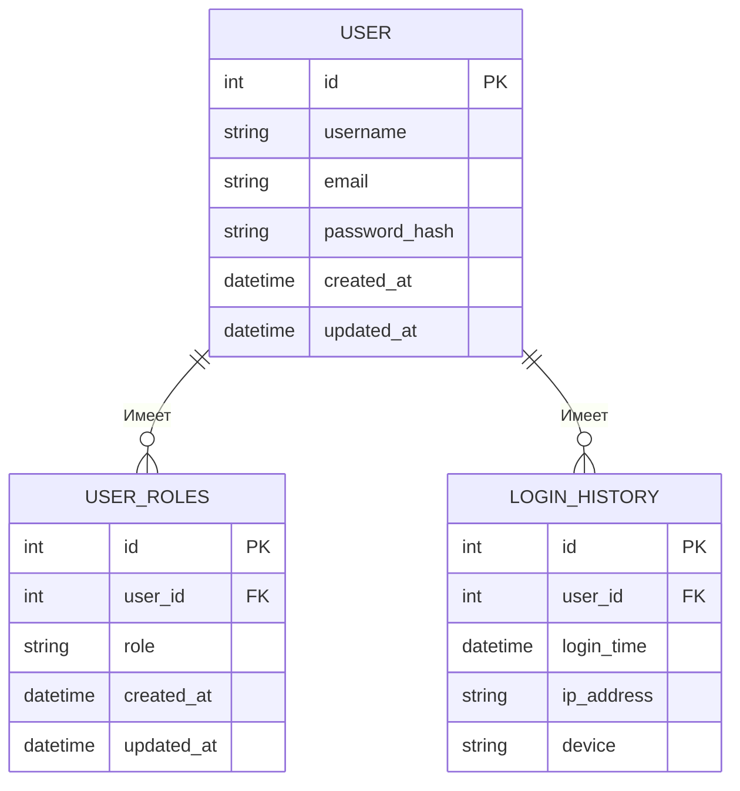
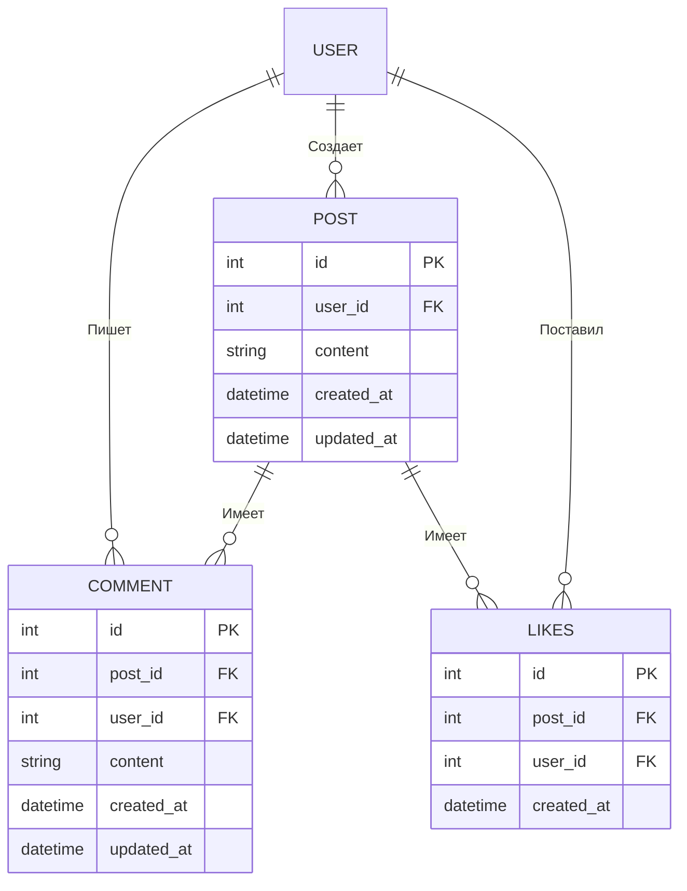
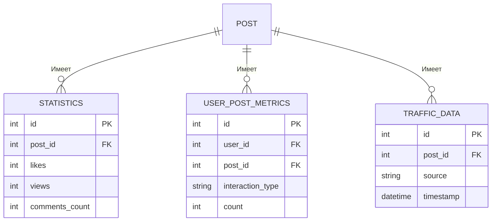

## Описание ER-диаграмм для сервисов

### 1. Сервис пользователей (User Service)
#### Описание полей:

**Таблица User:**
- **id (PK)**: Уникальный идентификатор пользователя.
- **username**: Имя пользователя, уникальное в системе.
- **email**: Электронная почта пользователя, уникальная.
- **password_hash**: Хэш пароля пользователя.
- **created_at**: Дата и время создания пользователя.
- **updated_at**: Дата и время последнего обновления информации о пользователе.

**Таблица UserRoles:**
- **id (PK)**: Уникальный идентификатор записи.
- **user_id (FK)**: Идентификатор пользователя.
- **role**: Роль пользователя (например, "admin", "user").
- **created_at**: Дата и время назначения роли.
- **updated_at**: Дата и время последнего обновления роли.

**Таблица LoginHistory:**
- **id (PK)**: Уникальный идентификатор записи.
- **user_id (FK)**: Идентификатор пользователя.
- **login_time**: Время последнего входа пользователя.
- **ip_address**: IP-адрес, с которого был выполнен вход.
- **device**: Устройство, с которого был выполнен вход.

#### ER-диаграмма:

---

### 2. Сервис постов и комментариев (Post Service)

#### Описание полей:

**Таблица Post:**
- **id (PK)**: Уникальный идентификатор поста.
- **user_id (FK)**: Идентификатор пользователя, создавшего пост.
- **content**: Содержание поста.
- **created_at**: Дата и время создания поста.
- **updated_at**: Дата и время последнего обновления поста.

**Таблица Comment:**
- **id (PK)**: Уникальный идентификатор комментария.
- **post_id (FK)**: Идентификатор поста, к которому оставлен комментарий.
- **user_id (FK)**: Идентификатор пользователя, написавшего комментарий.
- **content**: Содержание комментария.
- **created_at**: Дата и время создания комментария.
- **updated_at**: Дата и время последнего обновления комментария.

**Таблица Likes:**
- **id (PK)**: Уникальный идентификатор записи.
- **post_id (FK)**: Идентификатор поста.
- **user_id (FK)**: Идентификатор пользователя, который поставил лайк.
- **created_at**: Дата и время лайка.

#### ER-диаграмма:

---

### 3. Сервис статистики (Statistics Service)

#### Описание полей:

**Таблица Statistics:**
- **id (PK)**: Уникальный идентификатор статистики.
- **post_id (FK)**: Идентификатор поста, для которого собираются данные.
- **likes**: Количество лайков для поста.
- **views**: Количество просмотров поста.
- **comments_count**: Количество комментариев к посту.

**Таблица UserPostMetrics:**
- **id (PK)**: Уникальный идентификатор записи.
- **user_id (FK)**: Идентификатор пользователя.
- **post_id (FK)**: Идентификатор поста.
- **interaction_type**: Тип взаимодействия (например, "like", "comment", "view").
- **count**: Количество взаимодействий.

**Таблица TrafficData:**
- **id (PK)**: Уникальный идентификатор записи.
- **post_id (FK)**: Идентификатор поста.
- **source**: Источник перехода (например, "социальные сети", "поиск").
- **timestamp**: Время перехода.

#### ER-диаграмма:

---

### 4. Сервис API Gateway

#### Описание:
Этот сервис не имеет собственной базы данных и используется для перенаправления запросов к другим сервисам.

